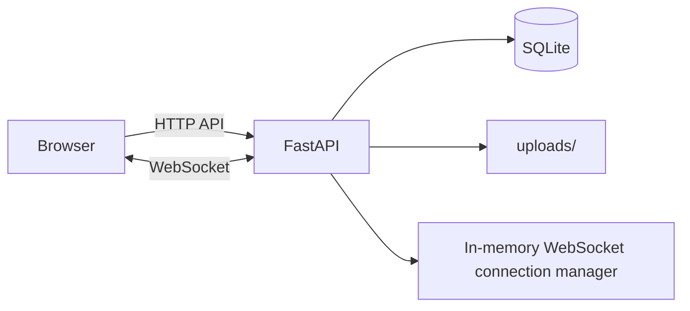

# FastAPI WebSocket Chatroom

A real-time chat application built with **FastAPI**, **WebSockets**, **SQLite**, and vanilla **HTML/CSS/JavaScript**.

The project supports multi-room chat, private messages, presence, typing indicators, read receipts, message editing/deletion, replies, reactions, file sharing, room management, search, and persistent chat history.

> **Project status:** complete as an educational/capstone project. See the [Security & production notes](#security--production-notes) before deploying it publicly.

## Features

- User registration and login
- Password hashing with `pwdlib`
- JWT-based authentication
- Real-time WebSocket messaging
- Public and private rooms
- Room creation, joining, leaving, and member management
- Online/offline presence
- Group chat and direct/private messages
- Typing indicators
- Persistent SQLite chat history
- Unread direct-message counters
- Sent/seen read receipts
- Edit and delete messages
- Reply to messages
- Emoji reactions
- File and image sharing
- 10 MB upload limit
- Room-message search
- Older room-message loading / pagination
- Responsive dark chat interface
- Per-tab browser sessions using `sessionStorage`

## Tech stack

- **Backend:** Python, FastAPI
- **Real-time transport:** WebSockets
- **Database:** SQLite
- **Authentication:** JWT + password hashing
- **Frontend:** HTML, CSS, vanilla JavaScript
- **File storage:** local `uploads/` directory

## Project structure

```text
websocket-chat/
├── .github/
│   └── workflows/
│       └── syntax-check.yml
├── docs/
│   └── screenshots/
│       └── README.md
├── uploads/
│   └── .gitkeep
├── .env.example
├── .gitattributes
├── .gitignore
├── GITHUB_CHECKLIST.md
├── README.md
├── SECURITY.md
├── index.html
├── main.py
└── requirements.txt
```

`chat.db`, database backups, Python cache files, and real user uploads are intentionally excluded from Git.

## Requirements

- Python **3.10+**
- `pip`

## Local setup

### 1. Clone the repository

```bash
git clone https://github.com/YOUR_USERNAME/YOUR_REPOSITORY.git
cd YOUR_REPOSITORY
```

### 2. Create a virtual environment

Windows PowerShell:

```powershell
python -m venv .venv
.\.venv\Scripts\Activate.ps1
```

macOS/Linux:

```bash
python3 -m venv .venv
source .venv/bin/activate
```

### 3. Install dependencies

```bash
pip install -r requirements.txt
```

### 4. Set the JWT secret

Generate a secret:

```bash
python -c "import secrets; print(secrets.token_urlsafe(48))"
```

Windows PowerShell:

```powershell
$env:CHAT_SECRET_KEY = "PASTE_YOUR_GENERATED_SECRET_HERE"
```

macOS/Linux:

```bash
export CHAT_SECRET_KEY="PASTE_YOUR_GENERATED_SECRET_HERE"
```

Do **not** commit a real secret to GitHub.

### 5. Run the application

```bash
python -m uvicorn main:app --reload
```

Open:

```text
http://127.0.0.1:8000
```

The application creates `chat.db` automatically on first run.

## File uploads

The app accepts these file types:

- JPG / JPEG
- PNG
- GIF
- WEBP
- PDF
- TXT
- CSV
- DOCX
- XLSX
- PPTX

Maximum upload size: **10 MB**.

Local uploads are stored in `uploads/`. Real uploaded files are ignored by Git to avoid publishing users' files.

## Architecture



### Main flow

1. A user registers or logs in through the HTTP API.
2. FastAPI returns a JWT access token.
3. The browser stores the active session in `sessionStorage`.
4. The browser opens an authenticated WebSocket connection for real-time events.
5. Messages are persisted in SQLite.
6. Connected clients receive message, presence, typing, reaction, edit/delete, and read-receipt updates in real time.

## HTTP endpoints

The current project includes endpoints for:

- `POST /api/register`
- `POST /api/login`
- `GET /api/rooms`
- `POST /api/rooms`
- `POST /api/rooms/{slug}/join`
- `POST /api/rooms/{slug}/leave`
- `GET /api/rooms/{slug}/members`
- `POST /api/rooms/{slug}/members`
- `DELETE /api/rooms/{slug}/members/{username}`
- `POST /api/upload`
- `GET /api/rooms/{slug}/messages`
- `GET /api/search/messages`
- `GET /api/search/dms`
- `WebSocket /ws/{room}`

## Database

SQLite stores application data such as:

- users
- rooms
- room memberships
- group messages
- direct conversations
- direct messages
- reactions
- upload metadata

The database file is created locally and is **not included in the GitHub repository**.

## Security & production notes

This project is suitable for coursework, demos, and local development. Before a public production deployment, address the following:

- Always set a strong `CHAT_SECRET_KEY` in the deployment environment.
- The code contains a development fallback secret; do not rely on it in production.
- Uploaded files are served from the `/uploads` path. For private production chats, use authenticated downloads or private object storage.
- Add rate limiting / brute-force protection to authentication and upload endpoints.
- Add password reset and email verification if required.
- Use HTTPS/WSS in production.
- SQLite and the in-memory WebSocket connection manager are best suited to a single application process. Multi-instance deployment would typically require a shared database such as PostgreSQL and shared pub/sub/presence infrastructure such as Redis.
- Add automated tests and database migrations before operating the service as a production system.

See [SECURITY.md](SECURITY.md) for repository-specific guidance.

## Screenshots

Add your final screenshots under `docs/screenshots/`, then replace these placeholders:

```markdown


```

## Suggested demo flow

1. Register two users in separate browser sessions.
2. Create or join a public room.
3. Exchange real-time room messages.
4. Demonstrate typing and online presence.
5. Send a direct message.
6. Demonstrate sent/seen receipts.
7. Reply and react to a message.
8. Edit and delete a message.
9. Upload an image/file.
10. Refresh the page and show that persisted messages remain.

## License

No license has been selected automatically. If you want other people to reuse the project, add a license before publishing. GitHub can generate common licenses such as MIT directly from the repository interface.
