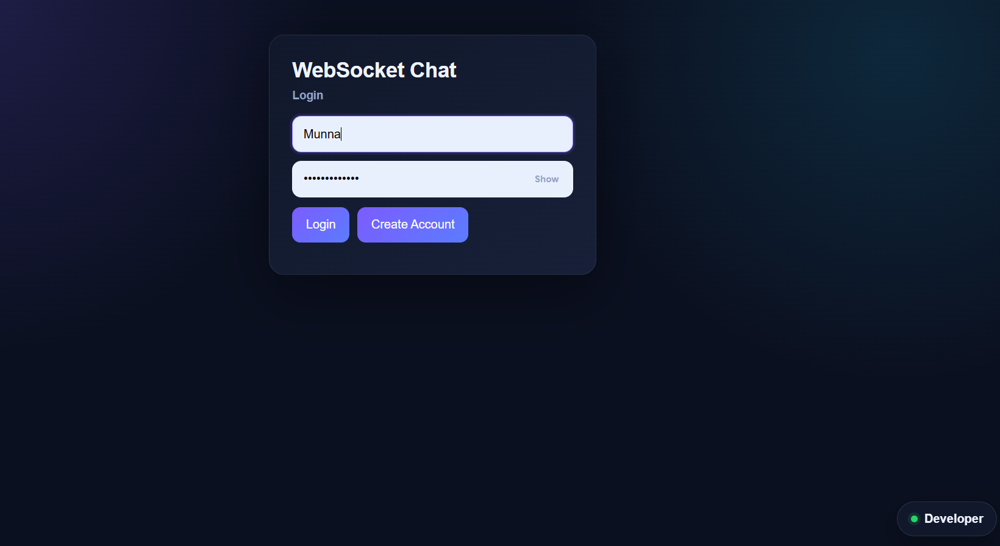
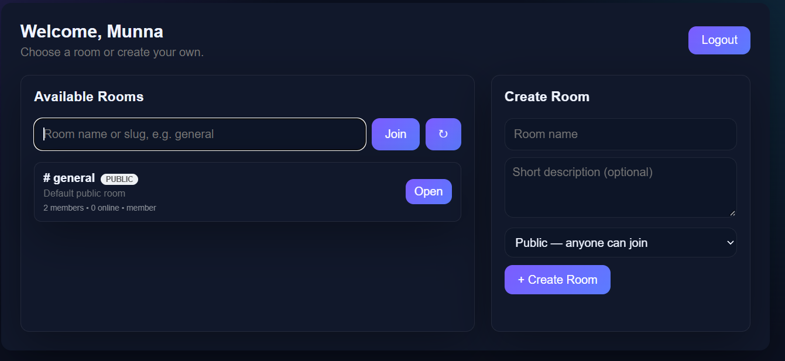
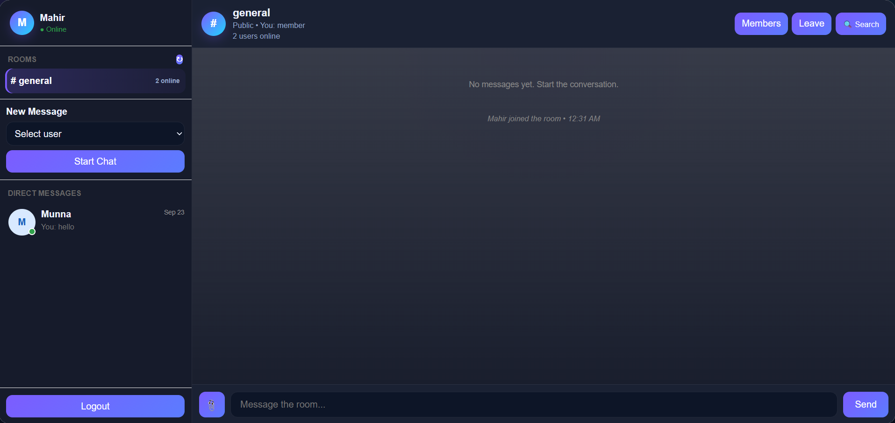
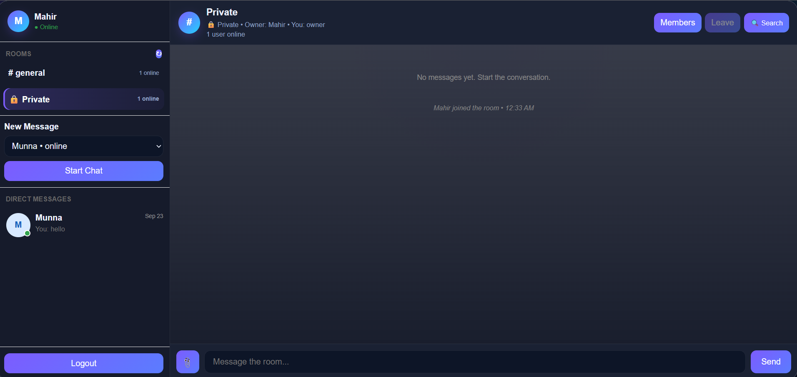
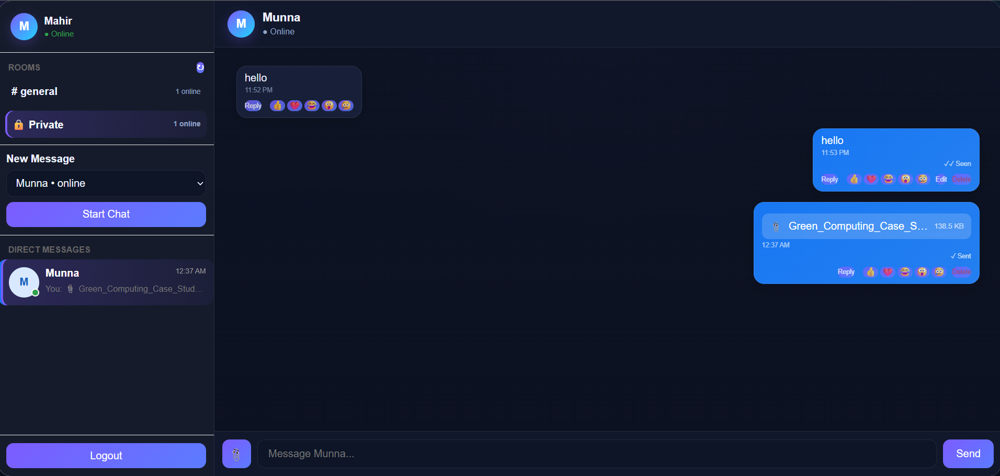
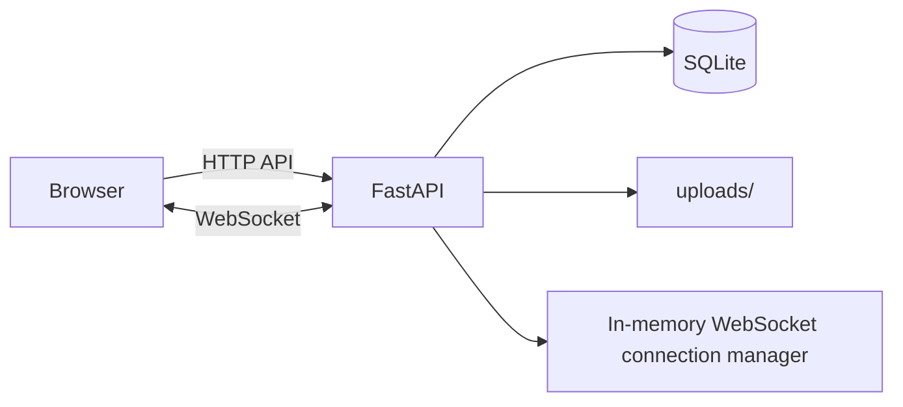

# FastAPI WebSocket Chatroom

A real-time multi-room chat application built with **FastAPI**, **WebSockets**, **SQLite**, **JWT authentication**, and vanilla **HTML/CSS/JavaScript**.

The project supports public/private rooms, direct messages, online presence, typing indicators, read receipts, message editing/deletion, replies, reactions, file sharing, room management, search, pagination, persistent chat history, and a built-in developer profile panel.

> **Project status:** Complete as an educational/capstone project.  
> See the [Security & production notes](#security--production-notes) before deploying publicly.

## Repository

**GitHub:** https://github.com/MDRyhanMunna/fastapi-websocket-chat

## Features

- User registration and login
- Password hashing with `pwdlib`
- JWT-based authentication
- Show/hide password controls on login and registration
- Real-time WebSocket messaging
- Public and private rooms
- Room creation, joining, leaving, and member management
- Online/offline presence
- Group chat and direct/private messages
- Typing indicators
- Persistent SQLite chat history
- Unread direct-message counters
- Sent/seen read receipts
- Edit and delete messages
- Reply to messages
- Emoji reactions
- File and image sharing
- Compact attachment preview before sending
- 10 MB upload limit
- Room-message search
- Older-message loading / pagination
- Responsive dark chat interface
- Per-tab browser sessions using `sessionStorage`
- Built-in developer profile panel

## Tech Stack

- **Backend:** Python, FastAPI
- **Real-time transport:** WebSockets
- **Database:** SQLite
- **Authentication:** JWT + password hashing
- **Frontend:** HTML, CSS, vanilla JavaScript
- **File storage:** Local `uploads/` directory

## Screenshots

### Login



### Room Directory



### Room Chat



### Private Chat



### File Sharing



## Project Structure

```text
fastapi-websocket-chat/
├── .github/
│   └── workflows/
│       └── syntax-check.yml
├── docs/
│   └── screenshots/
│       ├── file-sharing.png
│       ├── login.png
│       ├── private-chat.png
│       ├── room-chat.png
│       ├── room-directory.png
│       └── README.md
├── uploads/
│   └── .gitkeep
├── .env.example
├── .gitattributes
├── .gitignore
├── GITHUB_CHECKLIST.md
├── README.md
├── SECURITY.md
├── index.html
├── main.py
└── requirements.txt
```

`chat.db`, database backups, Python cache files, virtual environments, real secrets, and real user uploads are intentionally excluded from Git.

## Requirements

- Python **3.10+**
- `pip`
- A modern web browser

## Local Setup

### 1. Clone the repository

```bash
git clone https://github.com/MDRyhanMunna/fastapi-websocket-chat.git
cd fastapi-websocket-chat
```

### 2. Create a virtual environment

#### Windows PowerShell

```powershell
python -m venv .venv
.\.venv\Scripts\Activate.ps1
```

#### macOS / Linux

```bash
python3 -m venv .venv
source .venv/bin/activate
```

### 3. Install dependencies

```bash
pip install -r requirements.txt
```

### 4. Set the JWT secret

Generate a strong secret:

```bash
python -c "import secrets; print(secrets.token_urlsafe(48))"
```

#### Windows PowerShell

```powershell
$env:CHAT_SECRET_KEY = "PASTE_YOUR_GENERATED_SECRET_HERE"
```

#### macOS / Linux

```bash
export CHAT_SECRET_KEY="PASTE_YOUR_GENERATED_SECRET_HERE"
```

Do **not** commit your real secret to GitHub.

### 5. Run the application

```bash
python -m uvicorn main:app --reload
```

Open:

```text
http://127.0.0.1:8000
```

The application creates `chat.db` automatically on first run.

## File Uploads

The app accepts these file types:

- JPG / JPEG
- PNG
- GIF
- WEBP
- PDF
- TXT
- CSV
- DOCX
- XLSX
- PPTX

Maximum upload size: **10 MB**.

When a file is selected, the frontend shows a compact attachment preview before sending. Users can send the attachment with or without a text message.

Local uploads are stored in `uploads/`. Real uploaded files are ignored by Git so user files are not accidentally published.

## Architecture



### Main Flow

1. A user registers or logs in through the HTTP API.
2. FastAPI verifies credentials and returns a JWT access token.
3. The browser stores the active session in `sessionStorage`.
4. The browser opens an authenticated WebSocket connection.
5. Messages are persisted in SQLite.
6. Connected clients receive messages, presence, typing, reactions, edits/deletes, read receipts, and room updates in real time.

## HTTP and WebSocket Endpoints

The project includes endpoints such as:

- `POST /api/register`
- `POST /api/login`
- `GET /api/rooms`
- `POST /api/rooms`
- `POST /api/rooms/{slug}/join`
- `POST /api/rooms/{slug}/leave`
- `GET /api/rooms/{slug}/members`
- `POST /api/rooms/{slug}/members`
- `DELETE /api/rooms/{slug}/members/{username}`
- `POST /api/upload`
- `GET /api/rooms/{slug}/messages`
- `GET /api/search/messages`
- `GET /api/search/dms`
- `WebSocket /ws/{room}`

## Database

SQLite stores application data such as:

- users
- rooms
- room memberships
- group messages
- direct conversations
- direct messages
- reactions
- upload metadata

The database file is created locally and is **not included in the GitHub repository**.

## Developer Profile Panel

The frontend includes a floating **Developer** button on the login/register page and the room directory page.

The button is hidden inside room chats and private chats so it does not overlap the message composer or Send button.

The developer panel contains:

- Developer name
- Project description
- Technology stack
- GitHub link
- Portfolio link
- Email link

Configure the links near the bottom of `index.html`:

```javascript
const DEVELOPER_LINKS = {
    github: "https://github.com/MDRyhanMunna",
    portfolio: "",
    email: ""
};
```

You can add your portfolio link later after this project is added to your portfolio.

## Security & Production Notes

This project is suitable for coursework, demos, portfolio use, and local development.

Before a public production deployment:

- Always set a strong `CHAT_SECRET_KEY`.
- Do not rely on the development fallback secret.
- Use HTTPS/WSS.
- Add rate limiting and brute-force protection.
- Add password reset and email verification if required.
- Protect private file downloads with authenticated access.
- Consider private object storage for user uploads.
- Use a production database such as PostgreSQL for larger deployments.
- Use Redis or another shared pub/sub layer for multi-instance WebSocket deployments.
- Add automated tests and proper database migrations.
- Add logging, backups, and monitoring.

See [SECURITY.md](SECURITY.md) for repository-specific guidance.

## Suggested Demo Flow

1. Register two users in separate browser sessions.
2. Create or join a public room.
3. Exchange real-time room messages.
4. Demonstrate typing and online presence.
5. Send a direct message.
6. Demonstrate sent/seen receipts.
7. Reply and react to a message.
8. Edit and delete a message.
9. Upload an image or document.
10. Refresh the page and show that persisted messages remain.

## Updating the Project on GitHub

After making changes:

```bash
git add .
git commit -m "Describe your update"
git push
```

## License

No license has been selected automatically.

If you want other people to reuse the project, you can add an MIT License or another open-source license from GitHub.
